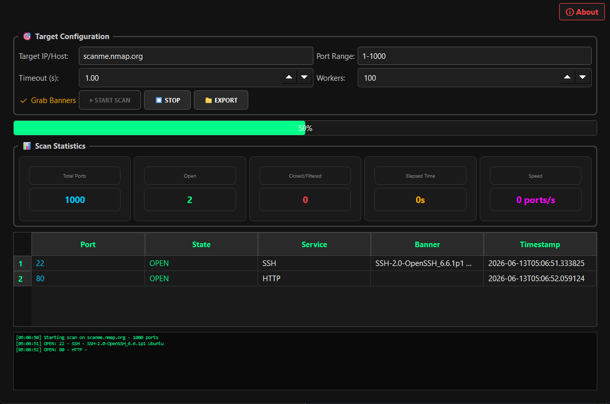
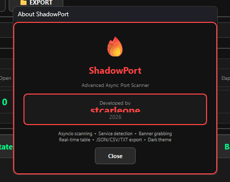

<div align="center">

# 🔥 ShadowPort

**Advanced Async Port Scanner for Security Professionals**

[](https://python.org)
[](https://riverbankcomputing.com)
[](LICENSE)
[]()


</div>

---

## 🚀 What is ShadowPort?

ShadowPort is a **high-performance asynchronous port scanner** built for gamers, network administrators, and cybersecurity professionals. Scan thousands of ports in seconds with beautiful real-time visualization and advanced statistics.

> ⚡ **1000+ ports per second** | 🎯 **17+ service detection** | 📡 **Banner grabbing** | 🎨 **Dark hacker theme**

---

## ✨ Features

| Feature | Description |
|---------|-------------|
| ⚡ **Asyncio Concurrent** | Scan 1000+ ports in under 2 seconds |
| 🎯 **Service Detection** | Auto-identify 17+ common services (SSH, HTTP, MySQL, etc.) |
| 📡 **Banner Grabbing** | Retrieve service banners from open ports |
| 📊 **Advanced Statistics** | Current, Average, Min, Max, 95th & 99th percentile |
| ⚠️ **Smart Thresholds** | Customizable warning levels with visual alerts |
| 🌐 **Multi-Host Tabs** | Monitor multiple targets simultaneously |
| 💾 **CSV Export** | Export all data for further analysis |
| 📝 **Auto Logging** | Automatic CSV logging with timestamps |
| 🔔 **System Tray** | Minimize to tray and continue monitoring |
| 🎨 **Dark Gaming Theme** | Eye-friendly dark UI for long sessions |

---

## 📸 Screenshots

<div align="center">

| Main Interface | About Dialog |
|:---:|:---:|
|  |  |

</div>

---

## 🚀 Quick Start

### Prerequisites
- Python 3.10 or higher
- pip package manager

### Installation

```bash
# Clone the repository
git clone https://github.com/stcarleone/shadowport.git
cd shadowport

# Install dependencies
pip install -r requirements.txt

# Run the application
python src/main.py
```

### Windows Executable
Download the latest release from [Releases](https://github.com/stcarleone/shadowport/releases) page.

---

## 📖 Usage Guide

### 1. Start Monitoring
```
Target: scanme.nmap.org
Ports: 1-1000
Interval: 250ms
Threshold: 100ms
Click ▶ START SCAN
```

### 2. Add Multiple Hosts
Click `+ Add Host` to monitor additional servers in separate tabs.

### 3. Export Results
Click `📁 EXPORT` to save data as JSON, CSV, or TXT.

---

## 🛠️ Tech Stack

- **Python 3.10+** - Core language
- **PyQt6** - GUI framework
- **asyncio** - Concurrent networking
- **matplotlib** - Real-time charts
- **ping3** - ICMP ping implementation
- **numpy** - Statistical calculations

---

## 🗺️ Roadmap

- [ ] Nmap XML import/export
- [ ] Masscan integration
- [ ] Whois lookup
- [ ] GeoIP location
- [ ] Alert notifications (email/webhook)
- [ ] Docker support

---

## ⚠️ Legal Disclaimer

This tool is intended for **authorized security testing only**. Always obtain proper written permission before scanning any network or system you do not own. The developer assumes no liability for misuse.

---

## 🤝 Contributing

Contributions are welcome! Please feel free to submit a Pull Request.

1. Fork the repository
2. Create your feature branch (`git checkout -b feature/AmazingFeature`)
3. Commit your changes (`git commit -m 'Add some AmazingFeature'`)
4. Push to the branch (`git push origin feature/AmazingFeature`)
5. Open a Pull Request

---

## 📜 License

This project is licensed under the **MIT License** - see the [LICENSE](LICENSE) file for details.

---

<div align="center">

## 👨‍💻 Developed by **stcarleone**

[](https://github.com/stcarleone)

⭐ **Star this repo if you find it useful!** ⭐

</div>
